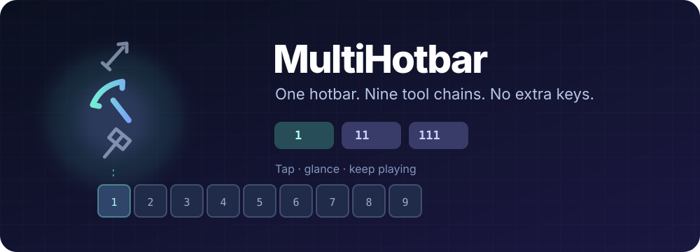

# MultiHotbar Universal

<p align="center">
  
</p>

<p align="center">
  <a href="https://github.com/sayore/multihotbar-universal/releases/latest"></a>
  <a href="https://github.com/sayore/multihotbar-universal/actions/workflows/build.yml"></a>
  <a href="LICENSE"></a>
</p>

<p align="center"><strong>Keep your tools one tap away. No extra keybinds. No extra HUD clutter.</strong></p>

MultiHotbar turns the inventory slot **directly above each hotbar slot** into a Hotbar Bundle controller. Tap that slot's number key again to move through its saved tools. All nine hotbar slots can have their own ordered group.

<p align="center"><a href="https://github.com/sayore/multihotbar-universal/releases/tag/v0.2.2"><strong>⬇ Download MultiHotbar 0.2.2</strong></a></p>

## One key. A whole tool chain.

| Tap | Slot 1 example | What happens |
|:---:|---|---|
| `1` | Sword | Select the primary item |
| `11` | Pickaxe | Select the first alternate |
| `111` | Axe | Select the second alternate |

The same rhythm works with `2` through `9`. Each tap restarts a **200 ms** chain window. Choose another hotbar number and that slot starts its own chain from the beginning.

### Glance, then go

When a valid MultiHotbar item is selected, a tiny vertical slice appears **over that exact hotbar slot**. It shows the nearest configured item before and after the selection when they exist. The active icon is larger and brighter; the others are smaller and dimmer. The slice lasts **720 ms**, fades away, and refreshes instantly on another tap.

The illustration above shows the idea. The in-game preview renders **item icons only**. There is no permanent panel, menu, or new gameplay keybind.

## Get started

1. Download the JAR matching **your Minecraft version and loader** from the [release assets](https://github.com/sayore/multihotbar-universal/releases/tag/v0.2.2). Install the same mod on the **client and server**; Fabric also needs Fabric API.
2. Craft a **Hotbar Bundle** with string above leather. In your inventory, left-click an item onto the bundle to append it. Right-click the bundle with an empty cursor to remove the last alternate.
3. Place the bundle immediately above a hotbar slot, put your primary item in that slot, close the inventory, and tap its number key repeatedly.

Each bundle holds up to eight alternate stacks. It is a dedicated storage item, not a vanilla Bundle with vanilla capacity rules.

## Choose your build

**Version 0.2.2** includes 14 JARs. Pick exactly one for each Minecraft instance.
The release also includes `SHA256SUMS.txt` for checking downloads.

| Minecraft | Fabric | Forge | NeoForge | Java |
|:---|:---:|:---:|:---:|:---:|
| 1.20.1 | [Download](https://github.com/sayore/multihotbar-universal/releases/download/v0.2.2/multihotbar-1.20.1-fabric.jar) | [Download](https://github.com/sayore/multihotbar-universal/releases/download/v0.2.2/multihotbar-1.20.1-forge.jar) | — | 17 |
| 1.20.4 | [Download](https://github.com/sayore/multihotbar-universal/releases/download/v0.2.2/multihotbar-1.20.4-fabric.jar) | — | [Download](https://github.com/sayore/multihotbar-universal/releases/download/v0.2.2/multihotbar-1.20.4-neoforge.jar) | 17 |
| 1.21.1 | [Download](https://github.com/sayore/multihotbar-universal/releases/download/v0.2.2/multihotbar-1.21.1-fabric.jar) | — | [Download](https://github.com/sayore/multihotbar-universal/releases/download/v0.2.2/multihotbar-1.21.1-neoforge.jar) | 21 |
| 1.21.4 | [Download](https://github.com/sayore/multihotbar-universal/releases/download/v0.2.2/multihotbar-1.21.4-fabric.jar) | — | [Download](https://github.com/sayore/multihotbar-universal/releases/download/v0.2.2/multihotbar-1.21.4-neoforge.jar) | 21 |
| 1.21.5 | [Download](https://github.com/sayore/multihotbar-universal/releases/download/v0.2.2/multihotbar-1.21.5-fabric.jar) | — | [Download](https://github.com/sayore/multihotbar-universal/releases/download/v0.2.2/multihotbar-1.21.5-neoforge.jar) | 21 |
| 1.21.8 | [Download](https://github.com/sayore/multihotbar-universal/releases/download/v0.2.2/multihotbar-1.21.8-fabric.jar) | — | [Download](https://github.com/sayore/multihotbar-universal/releases/download/v0.2.2/multihotbar-1.21.8-neoforge.jar) | 21 |
| 1.21.11 | [Download](https://github.com/sayore/multihotbar-universal/releases/download/v0.2.2/multihotbar-1.21.11-fabric.jar) | — | [Download](https://github.com/sayore/multihotbar-universal/releases/download/v0.2.2/multihotbar-1.21.11-neoforge.jar) | 21 |

> **Inventory stays vanilla.** While an inventory or container is open, number keys `1–9` keep their normal hotbar-swap behavior. Opening a screen closes the preview and resets the tap chain. `Shift + 1–9` backward navigation is intentionally absent.

## Build and verify

The mod is open source. From the repository root:

```sh
./build-matrix.sh all both   # Build every supported loader/version pair
./test-core.sh               # Sequence and slot logic
./test-preview.sh            # Preview acceptance tests for every target
./collect-jars.sh            # Copy release JARs into dist/
./doctor.sh                  # Show which builds are present
```

You can also build one target, such as `./build-matrix.sh 1.21.11 fabric`, or build and install one with `./install.sh 1.21.11 fabric`.

The client requests only a slot and sequence index. The server checks the controller and performs the actual item swap; the preview stays entirely client-side. See the [architecture notes](ARCHITECTURE.md), [changelog](CHANGELOG.md), and [build report](BUILD_REPORT.md) for implementation and verification details.

**Release checks:** all 14 JARs built and passed package inspection; preview acceptance tests passed for all seven Minecraft source variants; a NeoForge 1.20.4 dedicated server reached ready state. Interactive client appearance and multiplayer play still need manual verification.

Released under the [MIT License](LICENSE).
